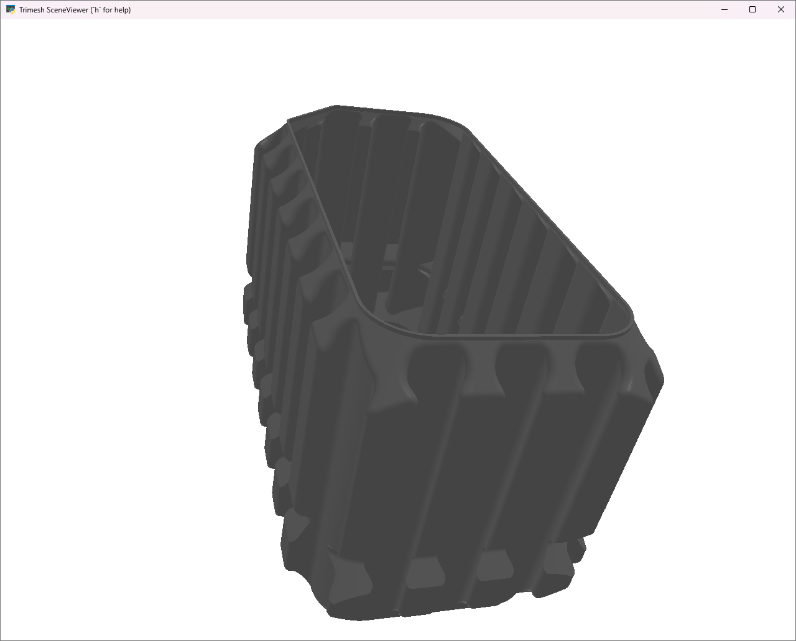
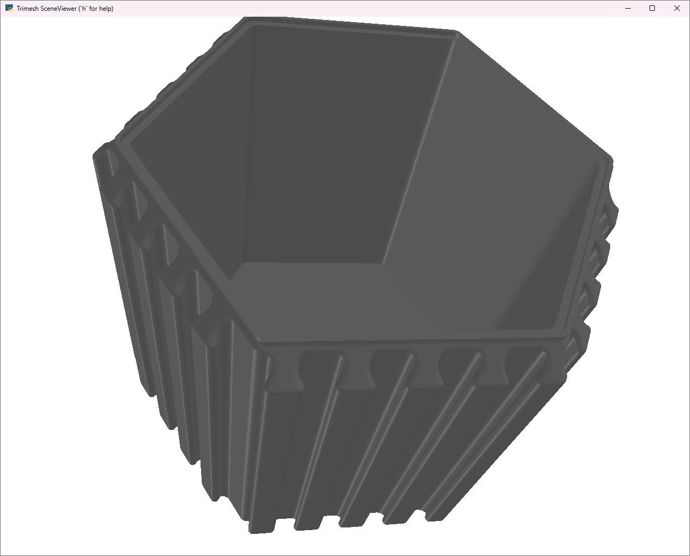

= interlocking_containers
:toc:

Python script used to generage the https://www.thingiverse.com/thing:7260807[interolocking containers]
for any random size. See below:

.Some sample of generated containers
image:doc/samples.png[samples]

.sizes[thingiverse]
image:doc/sizes.png[sizes]

== install

[source,bash]
----
$> git clone https://github.com/jujumo/interlocking_containers.git
$> cd interlocking_containers
$> python -m venv .venv
$> .venv/Scripts/activate
$> pip install .
----

== Create

=== box

To create a specific configuration, call `create_box`.
Print help message to get the detailed list of arguments:

[source,bash]
----
# by default, create a 3x3 40mm height box:
$>create_box -h
usage: create_box [--config CONFIG] [--output OUTPUT] [--nx NX] [--ny NY] [--height HEIGHT] [--fill FILL] [--scale SCALE] [--up UP] [--verbosity VERBOSITY]

Save a 3D box model.

options:
  -h, --help            Show this help message and exit.
  --config CONFIG       Path to a configuration file.
  --print_config[=flags]
                        Print the configuration after applying all other arguments and exit. The optional flags customizes the output and are one or more keywords separated by comma. The supported flags are: skip_default, skip_null.
  --output OUTPUT, -o OUTPUT
                        Output STL filename. (type: str, default: model.stl)
  --nx NX, -x NX        Number of divisions along the X axis. (type: int, default: 4)
  --ny NY, -y NY        Number of divisions along the Y axis. (type: int, default: 4)
  --height HEIGHT, -t HEIGHT
                        Height of the box in millimeters. (type: float, default: 40.0)
  --fill FILL, -f FILL  Whether the box is hollow (0 = solid, 1,2,3 = hollow). (type: int, default: 0)
  --scale SCALE, -s SCALE
                        Scaling factor applied to the model. (type: float, default: 1.0)
  --up UP, -u UP        Up direction axis (x, y, or z). (type: str, default: z)
  --verbosity VERBOSITY, -v VERBOSITY
                        Verbosity level (0 = quiet, 1 = show warnings+export, 2 = show mesh). (type: int, default: 1)
----

By default, `create_box` creates a 4x4x40mm tall solid box into "model.stl".
[source,bash]
----
$> create_box
  exporting "model.stl".
----

Of course, you can override the parameters you want.
For example, to create a 4x8x50 hollow container, do:

[source,bash]
----
$> create_box -x 4 -y 8 -t 50 -f 2 -o container_solid_H050_X04_Y08.stl -v 3
----

creates a :

 - `-x 4`: 4 notches wide
 - `-y 8`: 8 notches deep,
 - `-t 50` : 50mm tall,
 - `-f 2` : use hollow_2 model,
 - `-o container_solid_H050_X04_Y08.stl`: output in STL file "container_solid_H050_X04_Y08.stl",
 - `-v 3` : very verbose: it will open an interactive 3-D model viewer (see below). Hit "Q" for quit.

.interactive viewer

== honeycomb

[source,bash]
----
$> create_hex -n 5 -t 80 -f 3 -o honeycomb_hollow3_h80_n5.stl -v 3
----

creates a :

 - `-n 5`: 5 notches per side (or 9 on complementary sides)
 - `-t 80` : 80mm tall,
 - `-f 3` : use hollow_3 model,
 - `-o honeycomb_hollow3_h80_n5.stl`: output in STL file "container_solid_H050_X04_Y08.stl",
 - `-v 3` : very verbose: it will open an interactive 3-D model viewer (see below). Hit "Q" for quit.

.interactive viewer

== Batch factory

Finally, to create all config at once, call `create_batch`.
If you want a different set of configuration, you might want
to modify "interesting_*" variables in the source code.

[source,bash]
----
$> create_batch
# this will create a lot of different configurations (see below).
----

This will create all models in:
----
models
├── box
│   ├── hollow1
│   │   ├── height040
│   │   └── height050
│   ├── ...
│   └── solid
│       ├── height040
│       └── height050
└── honeycomb
    ├── hollow1
    │   ├── height040
    │   ├── ...
    │   └── height100
    ├── ...
    └── solid
        ├── height040
        ├── ...
        └── height100
----

Be aware the total combinations of models use **~7Gb of disk space**.

== Print

For details instructions, refer to
link:description_thingiverse_box.md[]