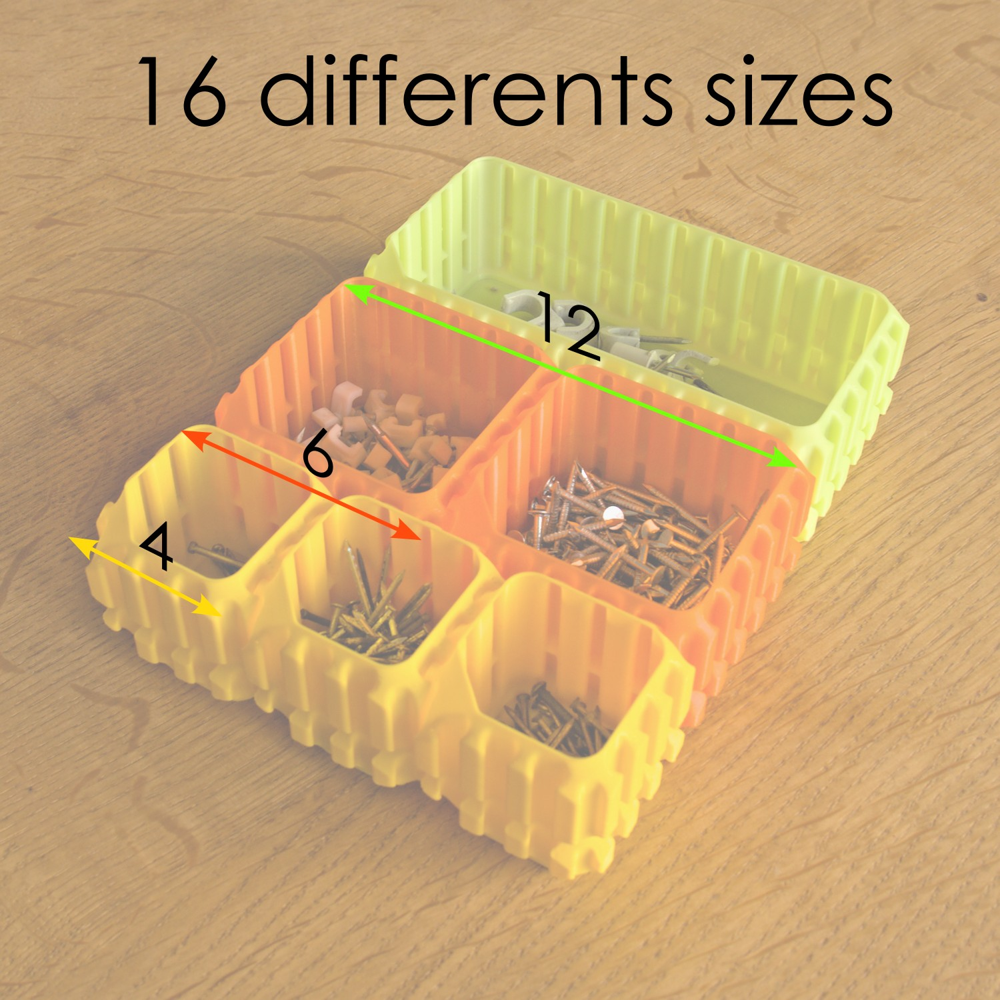

= interlocking_containers

Python script used to generage the https://www.thingiverse.com/thing:6241141[interolocking containers]
for any random size. See below:

.Some sample of generated containers
image:doc/samples.png[samples]

.sizes from https://www.thingiverse.com/thing:6241141[thingiverse]

== install

[source,bash]
----
$> git clone https://github.com/jujumo/interlocking_containers.git
$> cd interlocking_containers
$> python -venv .venv
$> .venv/Scripts/activate
$> pip install .
----

== run

[source,bash]
----
# by default, create a 3x3 40mm height box:
$> create_box
  exporting "stackable_x03y03z040t0s1.0uz.stl".
# you can override parameters
$> create_box --nx 3 --ny 9 --height 50 stackable_3x9.stl
# this will create a box of 3x9 notches, 50.mm height
$> create_batch
----

This will create all models in:
----
models
├── hollow
│   ├── height040
│   └── height060
└── solid
    ├── height040
    └── height060
----

Be aware the total combinations of boxes use **+2Gb of disk space**.

