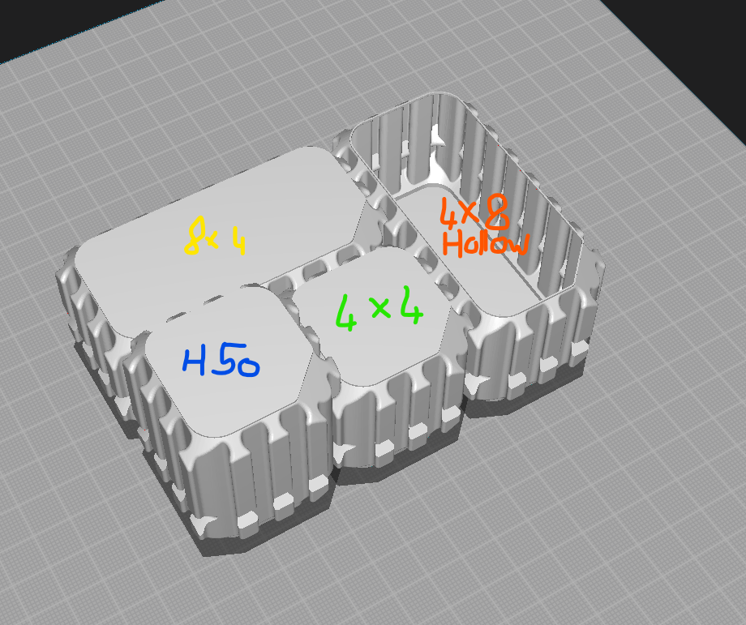
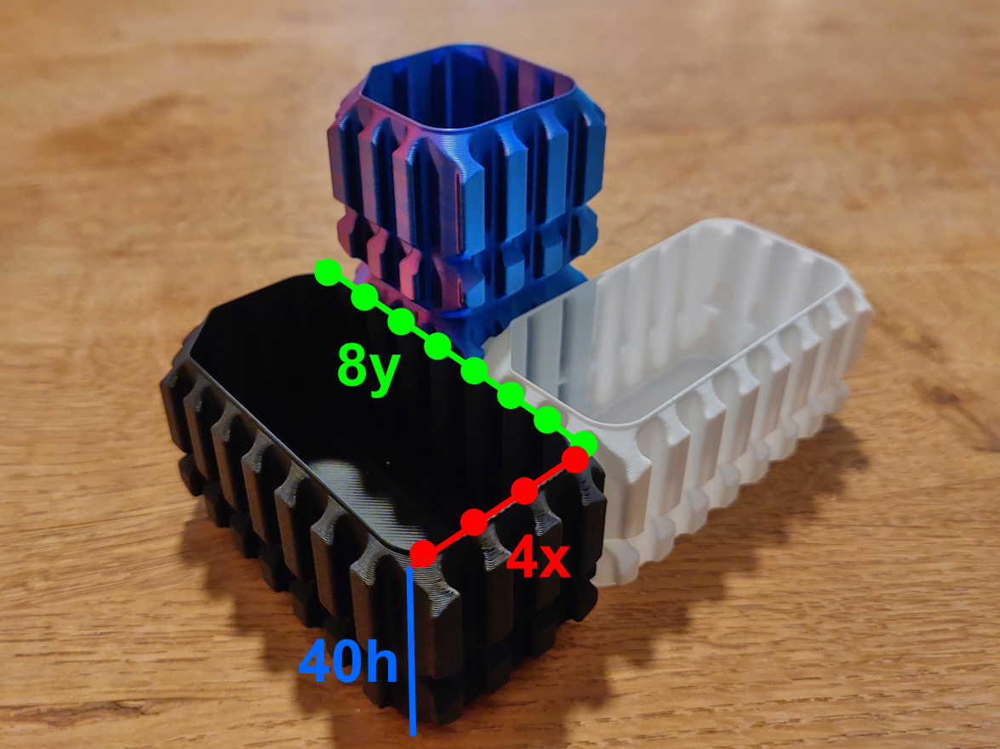

= interlocking_containers

Python script used to generage the https://www.thingiverse.com/thing:6241141[interolocking containers]
for any random size. See below:

.Some sample of generated containers

.sizes from https://www.thingiverse.com/thing:6241141[thingiverse]

== install

[source,bash]
----
$> git clone https://github.com/jujumo/interlocking_containers.git
$> cd interlocking_containers
$> python -m venv .venv
$> .venv/Scripts/activate
$> pip install .
----

== run

To create a specific configuration, call `create_box`.
Print help message to get the detailed list of arguments:

[source,bash]
----
# by default, create a 3x3 40mm height box:
$> create_box --help
usage: create_box [--config CONFIG] [--output OUTPUT] [--nx NX] [--ny NY] [--height HEIGHT] [--fill FILL] [--scale SCALE] [--up UP] [--verbosity VERBOSITY]

Save a 3D box model.

options:
  -h, --help            Show this help message and exit.
  --config CONFIG       Path to a configuration file.
  --print_config[=flags]
                        Print the configuration after applying all other arguments and exit. The optional flags customizes the output and are one or more keywords separated by comma. The supported flags are: skip_default, skip_null.
  --output OUTPUT       Output STL filename. (type: str, default: model.stl)
  --nx NX               Number of divisions along the X axis. (type: int, default: 4)
  --ny NY               Number of divisions along the Y axis. (type: int, default: 4)
  --height HEIGHT       Height of the box in millimeters. (type: float, default: 40.0)
  --fill FILL           Whether the box is hollow (0 = solid, 1,2,3 = hollow). (type: int, default: 0)
  --scale SCALE         Scaling factor applied to the model. (type: float, default: 1.0)
  --up UP               Up direction axis (x, y, or z). (type: str, default: z)
  --verbosity VERBOSITY
                        Verbosity level (0 = quiet, 1 = show warnings+export, 2 = show mesh). (type: int, default: 1)
----

By default, `create_box` creates a 4x4x40mm tall solid box into "model.stl".
[source,bash]
----
$> create_box
  exporting "model.stl".
----

Of course, you can override the parameters you want.
For example, to create a 4x8x50 hollow container, do:

[source,bash]
----
$> create_box --nx 4 --ny 8 --height 50 --fill 2 container_solid_H050_X04_Y08.stl
# this will create a box of 4x8 notches, 50.mm height
----

Finally, to create all config at once, call `create_batch`.
If you want a different set of configuration, you might want
to modify "interesting_*" variables in the source code.

[source,bash]
----
$> create_batch
# this will create a lot of different configurations (see below).
----

This will create all models in:
----
models
├── hollow1
│   ├── height040
│   └── height060
└── solid
    ├── height040
    └── height060
----

Be aware the total combinations of boxes use **~2Gb of disk space**.

